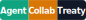

# Agent Collab Treaty

[](https://github.com/yzhaoinuw/agent_collab_treaty)

A drop-in documentation contract that helps future agent sessions pick up a repository where the last session left off, with less repeated reading, fewer lost decisions, and clearer handoffs. It works whether the next session uses the same agent, a different model, or a different machine.

Battle-tested on real projects with collaboration between Codex, Claude Code / Cowork, and Grok Build with near-zero friction.

## What This Is

Agent Collab Treaty installs a small, opinionated set of root-level Markdown files that any coding agent reads at the start of a session to learn:

- what environment to run in,
- what's active code versus legacy,
- what work is currently in flight,
- what was done in recent sessions,
- and what conventions to follow for commits and code style.

The template is language- and framework-agnostic. You fill in the project details once; future sessions follow the same map.

## What's In The Template

| File | Purpose |
|---|---|
| `AGENTS.md` | First-read contract: startup rule, doc map, runtime, common tasks, commit conventions, project reminders. |
| `project_overview.md` | Orientation map: active vs. legacy code, repo structure, and where to look first. |
| `next_steps.md` | Active roadmap. The "Currently Hot" section points agents to the threads that matter now. |
| `work_log.md` | Recent session journal, newest first. Agents prepend substantive work before handoff. |
| `work_log_archive/` | Rotated older work-log chunks, so the live log stays cheap to read. |

## How To Use

The fastest path is the `treaty` CLI. It installs and later updates the treaty files in new or existing projects.

### Option 1 - install the CLI, then run `treaty init`

```bash
# isolated install (recommended; requires pipx)
pipx install agent-collab-treaty

# or in a regular venv
pip install agent-collab-treaty

# then, from inside the project you want to add the treaty to:
treaty init
```

`treaty init` asks a few short questions and writes the treaty files into the current directory. Re-run later with `treaty update` to pull in upstream refinements without losing local edits.

In existing projects, `treaty init` first runs a non-destructive adoption preflight. It warns about existing treaty files, case-mismatched treaty-looking files such as `Work_Log.md`, and common planning/agent docs such as `TODO.md`, `ROADMAP.md`, `NOTES.md`, or `CLAUDE.md`. It does not move, archive, rewrite, or delete existing docs. Matching treaty template paths are skipped instead of overwritten.

Case-mismatched treaty-looking paths are blocking because they can prevent canonical files from being created, especially on Windows. Rename or archive them, then rerun `treaty init`.

> **Note**: `treaty update` requires a git-tracked project because Copier uses git for three-way merges. If needed, run `git init && git add . && git commit -m "treaty baseline"` once before the first update.

By default, `treaty init` installs only vendor-neutral treaty docs. You can also opt into pointer files for tools that do not reliably load `AGENTS.md` directly:

- `CLAUDE.md` for Claude Code / Cowork
- `.cursor/rules/treaty.mdc` for Cursor
- `.windsurf/rules/treaty.md` for Windsurf
- `.aider.conf.yml` for Aider

Non-interactive use:

```bash
treaty init . --defaults \
  --data integration_branch=main \
  --data env_activation='conda activate myenv' \
  --data test_command='pytest -v -m "not slow"' \
  --data 'agent_pointers=["claude-code", "cursor"]'
```

### Option 2 - use Copier directly

The CLI is a thin wrapper around [Copier](https://copier.readthedocs.io/):

```bash
pipx run copier copy gh:yzhaoinuw/agent_collab_treaty .
```

### Option 3 - just copy the files

Copy from [`template/`](template/) into your project, not from the repo root. The root files are this project's own dogfooded treaty docs. Replace the Jinja placeholders in `template/AGENTS.md.jinja`, rename it to `AGENTS.md`, and fill in the bracket placeholders in the other files.

Whichever path you pick, future agent sessions will read the files automatically. As work progresses, prepend new entries to `work_log.md` and keep `next_steps.md` honest about what's currently hot.

### Validate an installed treaty

Run `treaty validate` from any project using the treaty:

```bash
treaty validate
```

It checks canonical treaty filenames, `work_log.md` structure, live-log rotation, session verification sections, and `next_steps.md` Currently Hot links. Validation exits non-zero when issues are found; use `--warn-only` for advisory runs.

For existing projects that already have planning or agent docs, add `--migration-hints` to print concise, non-destructive overlap hints without changing files:

```bash
treaty validate --migration-hints
```

### Migrate existing docs with an agent

If a repo already has planning or logging docs, you can ask an agent to adopt them into the treaty. Be explicit that migration is authorized. For example:

> Please migrate this repo's existing planning and logging docs into the Agent Collab Treaty. Preserve originals unless you explain and get approval before moving or rewriting them.

The agent should inspect legacy docs, summarize active work into `next_steps.md`, preserve useful history in `work_log.md` or `work_log_archive/`, add bridge notes where helpful, run `treaty validate . --migration-hints`, and document what changed in `work_log.md`.

## Badge

`treaty init` offers to add the Agent Collab Treaty "adopted" badge to your README by default. The badge is hosted centrally by this repository — your project receives **no extra files**, and the image URL will continue to serve the latest design if we improve the badge later.

The exact markdown snippet is printed in the post-copy message when you run `treaty init` (with the `include_treaty_badge` question enabled, the default).

**Recommended (centrally hosted SVG — automatic updates, official look):**

```markdown
[](https://github.com/yzhaoinuw/agent_collab_treaty)
```

**Zero-dependency alternative (shields.io — no image hosting required):**

```markdown
[](https://github.com/yzhaoinuw/agent_collab_treaty)
```

This repo itself uses the locally-hosted version of the badge (relative path in our README) so the dogfood experience does not depend on raw.githubusercontent.com. All other adopters use the central URL above.

## Wiring Up Your Agent

`AGENTS.md` is the one file every agent should read at the start of a session. Some tools load it directly; others work better with a small pointer file.

`treaty init` keeps the default install vendor-neutral, but it can generate pointer files when you select them during setup:

| Tool | Pointer generated by `treaty init` | Notes |
|---|---|---|
| Codex | none | Codex reads `AGENTS.md` natively. |
| Claude Code / Cowork | `CLAUDE.md` | Imports `AGENTS.md` with Claude's `@AGENTS.md` syntax. |
| Cursor | `.cursor/rules/treaty.mdc` | Always-applied project rule that points Cursor back to `AGENTS.md`. Cursor also supports root `AGENTS.md` directly. |
| Windsurf | `.windsurf/rules/treaty.md` | Always-on workspace rule that points Cascade back to `AGENTS.md`. Windsurf also processes root `AGENTS.md` directly. |
| Aider | `.aider.conf.yml` | Configures Aider to always read `AGENTS.md` as read-only context. |

For any other tool, add a one-line default instruction such as: *"At the start of every new chat or session in this repository, read `AGENTS.md` first and follow the documentation map there."*

## The Workflow In Practice

When a new agent session opens:

1. Read `AGENTS.md` first.
2. Use its documentation map to open only the relevant docs.
3. Read the top of `work_log.md` for recent context.
4. Check `next_steps.md` -> "Currently Hot" for active priorities.
5. Do the work, following the conventions in `AGENTS.md`.
6. At the end of substantive work: run the pre-flight checklist from `AGENTS.md`, run `treaty validate`, prepend a structured entry to `work_log.md`, and update `next_steps.md` if follow-up changed. Skip the log only for trivial exchanges or when the user explicitly says not to document the session.

## Rotation Policy

`work_log.md` stays small by rotating older dates into archive files:

- The live `work_log.md` holds at most the **5 most recent unique calendar dates**.
- When prepending a new date would push the live log past 5 unique dates, move the oldest 5 dates as a chunk into a new file at `work_log_archive/work_log_<earliest>_to_<latest>.md`. Each archive file holds exactly 5 dates.
- All files (live and archive) use the same `## YYYY-MM-DD` header convention, so the anchor-grep recipe in `AGENTS.md` works across both with one command:

  ```
  rg -n '^## [0-9]{4}-[0-9]{2}-[0-9]{2}' work_log.md work_log_archive/
  ```

## Why "Treaty"

Because it is a small agreement about where project context lives, what agents read first, and what they write back before leaving.

## Releasing to PyPI

(This section is for maintainers of this repo. End users should follow [How To Use](#how-to-use) instead.)

Two GitHub Actions workflows handle publishing:

- `.github/workflows/release.yml` — fires on a `v*` tag push, builds sdist + wheel, publishes to PyPI, and creates a GitHub Release.
- `.github/workflows/test-publish.yml` — `workflow_dispatch` (manual) trigger, publishes to TestPyPI for dry-runs.

Both use [PyPI Trusted Publishing](https://docs.pypi.org/trusted-publishers/) (OIDC), so no API tokens are stored in the repo.

### One-time setup (per maintainer)

1. **PyPI account**: create one at https://pypi.org if you don't have one.
2. **TestPyPI account**: create a *separate* one at https://test.pypi.org. (TestPyPI is fully independent and uses different credentials.)
3. **Register the project as a Pending Publisher on PyPI**:
   - Go to https://pypi.org/manage/account/publishing/
   - Click "Add a new pending publisher"
   - Fill in: PyPI project name `agent-collab-treaty`, owner `yzhaoinuw`, repo `agent_collab_treaty`, workflow filename `release.yml`, environment name `pypi`.
4. **Register on TestPyPI the same way**:
   - Go to https://test.pypi.org/manage/account/publishing/
   - Same values, except workflow filename `test-publish.yml` and environment name `testpypi`.
5. **Create the two GitHub environments**: in repo Settings → Environments, create `pypi` and `testpypi`. No secrets needed (OIDC handles auth). Optionally add protection rules (e.g., require manual approval for `pypi`).

### Cutting a release

Dry-run first:

```bash
# in the GitHub Actions tab → "Publish to TestPyPI (manual dry-run)" → Run workflow
# (or via CLI:)
gh workflow run test-publish.yml
```

After the TestPyPI publish succeeds, install from TestPyPI to smoke-test:

```bash
pipx install --index-url https://test.pypi.org/simple/ \
  --pip-args="--extra-index-url https://pypi.org/simple/" \
  agent-collab-treaty
```

When the dry-run looks good, cut the real release:

```bash
# bump pyproject.toml version if needed, then:
git tag v0.1.0
git push origin v0.1.0
# release.yml will fire, publish to PyPI, and create a GitHub Release
```

## Customization

Treat this as a starting point, not a fixed standard. Common per-project additions:

- A "Pre-commit Note" or "CI Note" section in `AGENTS.md` with the specific commands your stack uses (e.g., Black + pytest for Python, Prettier + Jest for JS).
- A "Domain Reminders" section in `AGENTS.md` for non-obvious gotchas (e.g., "don't blow away debug breadcrumbs during pipeline iteration").
- Subsections of `project_overview.md` for the architecture diagrams or data schemas that matter most.

Keep additions coherent with the existing structure rather than rewriting it — the value of a shared template is that every repo looks the same to the next agent.
